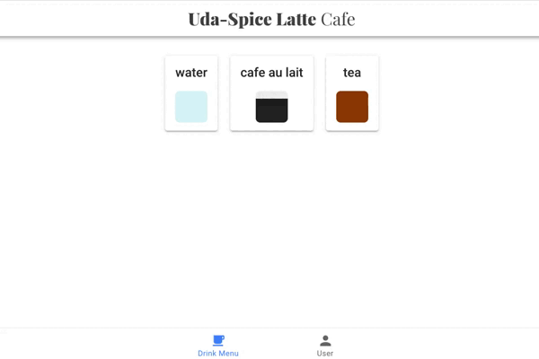

# Coffee Shop Project

Udacity has decided to open a new digitally enabled cafe for students to order drinks, socialize, and study hard. But they need help setting up their menu experience.

I have been called on to demonstrate my newly learned skills to create a full stack drink menu application. The application has the following functionalities:

1. Display graphics representing the ratios of ingredients in each drink.
2. Allow public users to view drink names and graphics.
3. Allow the shop baristas to see the recipe information.
4. Allow the shop managers to create new drinks and edit existing drinks.



## Getting Started

### Prerequisites

Developers using this project should have the following already installed.

- Python3
- pip
- node
- npm

## Installing Dependencies

### Fontend

See [`./frontend/`](./frontend/README.md) for instructions on how to install dependencies and start the application.

### Backend Dependencies

See [`./backend/](backend/README.md) for instructions on how to install dependencies and start the application.

## Testing

- Import the postman collection [`./starter_code/backend/udacity-fsnd-udaspicelatte.postman_collection.json`](backend/)
- Run the collection.

## API Reference

---

### Getting Started

Base URL: Currently this application is only hosted locally. The backend is hosted at http://127.0.0.1:5000/

Authentication: This version does not require authentication or API keys.

### Error handling

Errors are returned as JSON in the following format:

```json
{
    "success": False,
    "error": 404,
    "message": "resource not found"
}
```

### Endpoints

Has role based access, thus only users with specific roles can perform some functionalities such as updating and deleting drinks.
Roles: 1. Public - GET '/drinks' 2. Barrista - Permissions: 1. "get:drinks" 2. "get:drinks-detail" 3. Manager - Permissions: 1. "get:drinks" 2. "get:drinks-detail" 3. "patch:drinks" 4. "Delete:drinks"

`GET '/drinks'`

- Fetches all drinks
- Request Arguments: None
- Returns: A list of drinks.

Sample request via `curl`:

```
curl http://127.0.0.1:5000/drinks
```

Response

```json
{
	"drinks": [
		{
			"id": 1,
			"recipe": [{ "color": "blue", "name": "water", "parts": 1 }],
			"title": "water"
		}
	],
	"success": true
}
```

`GET '/drinks-detail'`

- Fetches long form of all drinks.
- Request Arguments: requires permission `get:drinks-detail`
- Returns: A list of drinks.

Sample request via `curl`:

```bash
curl -H 'Accept: application/json' -H "Authorization: Bearer ${TOKEN}" http://\{localhost:5000\}/drinks-detail
```

Response

```json
{
	"drinks": [
		{
			"id": 1,
			"recipe": [{ "color": "blue", "name": "water", "parts": 1 }],
			"title": "water"
		}
	],
	"success": true
}
```

`POST '/drinks'`

- Posts new drink
- Request Arguments:

  1. Requires permission `post:drinks`
  2. Title and recipe of drink

- Returns: A list of drinks.

`PATCH '/drinks/id'`

- Updates existing drinks
- Request Arguments:

  1. Requires permission `patch:drinks`
  2. Drink id
  3. Title and recipe of drink

- Returns: A list of drinks.

`DELETE '/drinks/id'`

- Deletes existing drinks
- Request Arguments:

  1. Requires permission `delete:drinks`
  2. Drink id

- Returns: A list of drinks.

## Acknowledgement

- [Udacity](udacity.com)
